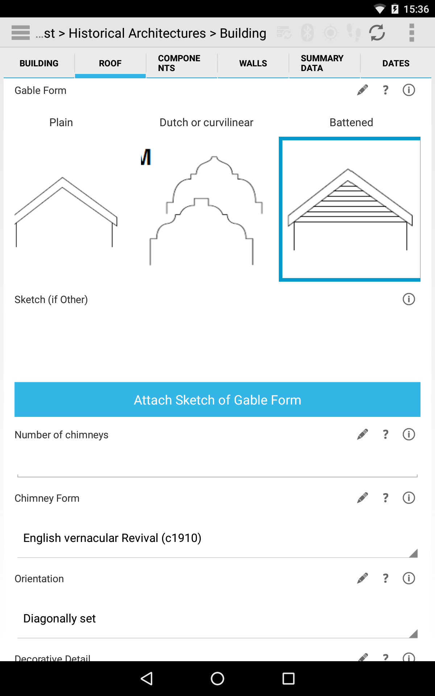
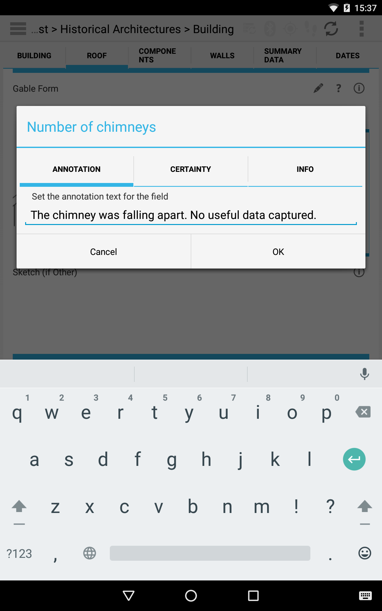
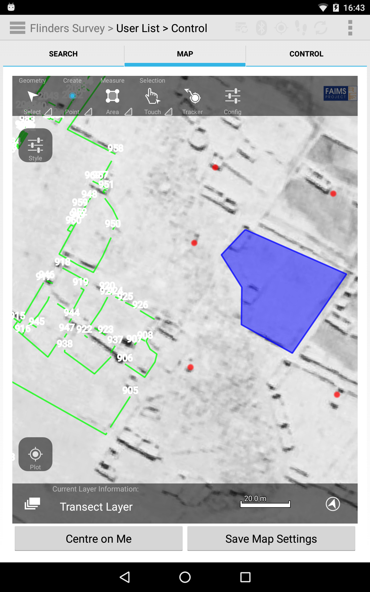

FAIMS Mobile: Flexible, open-source software for field research

Brian Ballsun-Stantona, Shawn A. Rossb,*, Adela Sobotkovaa, Penny Crookc

aDepartment of Ancient History, Macquarie University, Sydney, Australia

bBig History Institute, Department of Modern History, Politics, and International Relations, and Department of Ancient History, Macquarie University, Sydney, Australia

cDepartment of Archaeology, La Trobe University, Melbourne, Australia

*Corresponding author. Department of Ancient History, W6A 510, Macquarie University 2109 NSW, Australia. Tel.: +61 9850 7085. Email: [shawn.ross@mq.edu.au](mailto:shawn.ross@mq.edu.au). Other email addresses: [brian.ballsun-stanton@mq.edu.au](mailto:brian.ballsun-stanton@mq.edu.au) (B. Ballsun-Stantoni),  [adela.sobotkova@mq.edu.au](mailto:adela.sobotkova@mq.edu.au) (A. Sobotkova), and [p.crook@latrobe.edu.au](mailto:p.crook@latrobe.edu.au) (P. Crook). 

# Abstract 

FAIMS Mobile is a native Android application supported by an Ubuntu server facilitating human-mediated field research across disciplines. It consists of ‘core’ Java and Ruby software providing a platform for data capture, which can be deeply customised using ‘definition packets’ consisting of XML documents (data schema and UI) and Beanshell scripts (automation). Definition packets can be autogenerated using an XML-based domain specific language. FAIMS Mobile includes features allowing rich and efficient data capture tailored to the needs of fieldwork. It also promotes synthetic research and improves transparency and reproducibility through the production of comprehensive datasets that can be mapped to vocabularies or ontologies as they are produced. 

# Keywords: 

Android; Mobile software; Field research; Archaeology; Geoscience; Ecology; Oral history

# 1. Motivation and Significance

Many disciplines in the social sciences, humanities, and biological, earth, and environmental sciences depend upon data generated through human-mediated fieldwork. Such data might arise from excavation in archaeology, wildlife observation in ecology, soil sampling in environmental geochemistry, or subject interviews in oral history. Field research disciplines like archaeology, geology, and ecology, however, often lack transparency and reproducibility, compromising the integrity of research results [[1]](https://paperpile.com/c/q8e6UH/RZ3x). Field data is often collected using an ad-hoc mix of hard copy, data fragments in various formats, and bespoke databases [[cf. 2,3,4]](https://paperpile.com/c/q8e6UH/Zml6+qiYG+fOUI/?prefix=cf.,,). Datasets, furthermore, are often trapped in hard-copy archives, local storage or, digital 'silos', making them difficult to discover and limiting reinterpretation and reuse (Blanke & Hedges 2010). Digital datasets are often highly variable, of poor quality, and incompatible. Deficiencies like these inhibit re-analyses of primary data and the combination of datasets from multiple studies for large-scale research [[1,2,5]](https://paperpile.com/c/q8e6UH/RZ3x+Zml6+W6hf/?locator=1025,567,). 

Insufficient attention has been paid to the development of software specifically designed for digital data collection during field research. Some tools exist for discrete tasks, such as measuring strikes and dips for structural geology (e.g., GeoCline or Rocklogger for Android), but more complex and flexible field data collection has been neglected. Most digital data collection in archaeology, for example, is accomplished either using a combination of generic and repurposed mobile and desktop applications (e.g., multimedia, office productivity, GIS, database, or questionnaire / survey software), or by building bespoke applications. Both approaches have severe limitations [[6]](https://paperpile.com/c/q8e6UH/mmY2). Bespoke software is expensive to build and maintain, placing it beyond the reach of all but the best-funded projects and organisations (e.g., iDig, created by the American School of Classical Studies at Athens: http://idig.tips/; cf. [[7]](https://paperpile.com/c/q8e6UH/lJKF). Repurposed software requires field researchers to make do with applications, designed for other contexts, which lack critical features but still require extensive customisation (cf. the use of a suite of iOS applications at Pompeii [[8]](https://paperpile.com/c/q8e6UH/CiDt), or Ben Carter’s combination of Kobo Toolbox, PostGIS, QGIS, LibreOffice Base, and pgadminIII: [http://digitalarchaeology.msu.edu/crafting-work-flow-kobo-toolbox-postgis-qgis-libreoffice-base-pgadminiii/](http://digitalarchaeology.msu.edu/crafting-work-flow-kobo-toolbox-postgis-qgis-libreoffice-base-pgadminiii/)). 

FAIMS Mobile, conversely, is ‘generalised’ software which combines the particular features required for field research with sufficient customisability and redeployability to allow its use across disciplines, providing a large enough user base to support its development and maintenance and have a meaningful impact on research (see Section 4 below; cf. [[6]](https://paperpile.com/c/q8e6UH/mmY2)). FAIMS Mobile is open source software developed by the Field Acquired Information Systems Project, an e-research infrastructure project based at Macquarie University, Sydney, Australia. It is mature software that has been under development since 2012. Most other generalised field data collection software used for fieldwork, such as ARK, Heurist, or Kora [[9]](https://paperpile.com/c/q8e6UH/inwA), require a continuous connection to a server.

FAIMS is most comparable to Open Data Kit (ODK) and its variants, but is differentiated by its lineage. ODK, another mature offline mobile data collection platform, was designed for social surveys, where an investigator asks questions of a interviewee. FAIMS, conversely, originated in archaeology, where an investigator records observations about things in the material world, relationships between those observations, and metadata contextualising the collection of those observations. Both projects are open-source, Java-based data collection platforms with similar potential and shared libraries, serving researchers who face similar problems; while solutions to those problems diverged significantly when FAIMS began development, over time features have converged to a degree. Features specific to FAIMS include mature bi-directional synchronisation across all devices (an alpha feature in ODK 2.0), use of an append-only datastore that provides a version history for all records, support for a wider range of external sensors, and more advanced GIS data operations (compared to GeoODK). Provisions for help and metadata capture are also richer and more granular. Field research projects, especially in liminal disciplines such as linguistics or oral history, would be wise to evaluate both platforms. 

## 1.1. Experimental setting

FAIMS Mobile is designed to collect heterogenous data of various types (structured, free text, geospatial, multimedia) produced by arbitrary methodologies during human-mediated field research. It requires customisation to instantiate a project-specific data model, user interface, and workflow, but it addresses problems shared across field-based projects, such as provision of a mobile GIS and automated synchronisation across multiple devices in a network-degraded environment.  

During a typical deployment, researchers work with FAIMS project staff to articulate their data model and workflow. A FAIMS developer then renders that methodology into a package of definition documents that produce a ‘module’ (i.e., an implementation of FAIMS Mobile customised for a particular project). Separate definition documents control the data schema (XML), the user interface (XML and CSS), and automation and logic (Beanshell), offering nuanced control. The interface can also be translated into multiple languages using a (plain text) localisation file. Completed modules are then deployed to a local or online Ubuntu server, and from there onto as many Android devices as needed (after the core mobile application is installed, e.g. from Google Play). Data is then collected using those devices, which can operate fully offline, and synchronised opportunistically when a network connection to the server is available. Data can be validated at the time of entry on the device, or later on the server. At the end of data collection, data is exported in the user’s desired format by means of a customisable exporter. Three deployment case studies have been published in Sobotkova, et al., 2016[[6]](https://paperpile.com/c/q8e6UH/mmY2).

Alternatively, FAIMS has developed a XML-based domain specific language (DSL) to simplify customisation. Using this DSL, a single file can be used to generate all necessary definition documents. Several projects have successfully customised FAIMS Mobile themselves using this DSL[[10]](https://paperpile.com/c/q8e6UH/KaDj).

# 2. Software Description

FAIMS Mobile is open-source, customisable software designed specifically to support field research across many domains. It allows offline collection of structured, text, multimedia, and geospatial data on multiple Android devices, and is built around an append-only datastore that provides complete version histories. It includes customisable export to existing databases or in standard formats, supported by features that facilitate data compatibility. Finally, it is designed for rapid prototyping using and easy redeployability to reduce the costs of implementation. 

## 2.1. Software Architecture

# *Give a short overview of the overall software architecture; provide a pictorial component overview or similar (if possible). If necessary provide implementation** details.*

FAIMS Mobile consists of 'core' software written in Java and Ruby, customised to particular deployments using XML, Beanshell, and CSS. We use the following technologies:

* Javarosa to render native Android UI elements at runtime;

* Sqlite3 to store an attribute-key-value datastore (with research data schemas definable at runtime);

* An append-only data model inspired by Google's Protobufs;

* Beanshell to provide runtime scripting via calls to an underlying Java API;

* Spatialite to encode geospatial data in the datastore;

* NativeCSS to style android-native elements;

* Antlr3 as a grammar parser for identifiers; and a

* Ruby on rails/apache stack to provide a field server.

In order to render arbitrary field research data methodologies, we needed to build a system capable of rendering and recording arbitrary field data. This data was multi-valued, multi-media and contained many geometries. No single, static methodology would be worth the investment in time it would take to build and deploy an android application. 

Therefore, we built an Android client which could, at runtime, render an arbitrary data collection methodology, save it to a database, and eventually synchronize that data with other instances running on other devices. This distinction is much like the one between a web browser and a website. A browser contains many sophisticated engines for rendering the page, its interactivity, and its styling, but does not have content. A website *uses* the html engine provided by the browser to display its specific content the way it should be displayed. FAIMS Mobile contains Sqlite, a Javarosa parser, and Beanshell providing engines for rendering the 'module', providing interactivity, and styling it. 

One discovery we found over the four years of development is that quality assurance not only of the application, but the data collection modules themselves is difficult, time consuming, and often neglected. One recent feature added was complete Robotium support for unit and integration tests upon arbitrary forms, such that data can be added via the normal user interface in arbitrary amounts. This allows users to load test their forms under simulated field conditions. 

## 2.2. Software Functionalities

FAIMS Mobile improves field research by providing a wide range of features that specifically address the needs of field research across disciplines, while facilitating the production of compatible datasets from  heterogeneous data structures and workflows. These features include:

* Deep customisation of data schema, user interface, and automation using either a packet of XML, Beanshell, and CSS documents for nuanced control, or a single file in an XML-based domain-specific language for ease of deployment. Definition document(s) are separate for core software, making modification and reuse easier.

* Collection of various data types within a single record, including structured data, geospatial data, free text, sensor-produced multimedia, and file attachments.

* Automated, configurable synchronisation across an unlimited number of devices using a local or online server. 

* Synchronisation is opportunistic, whenever a connection is available, allowing devices to work in network-degraded environments or offline for extended periods of time. Robust offline capability is achieved through maintenance of the datastore on each device, not caching.

* Defaults, flow logic, hierarchical selections, dynamic UI (expand, collapse, hide, or show input fields), and other advanced data collection features.

* Mobile GIS supporting raster and vector data, layer management, legacy data visualisation, and point, line, and polygon creation and editing. Multiple records can be linked to a single shape, or multiple shapes to a single record.

* ‘Annotation’ and ‘certainty’ fields attached to every record. The former allows the collection of granular metadata (mimicking the ‘margins of the page’ in paper recording), while the latter allows users to record their confidence in an observation. 

* Internal and external sensor support, external Bluetooth devices like GPS receivers and USB / HID devices like digital balances and calipers.

* Multilingual support using a localisation file.

* An append-only datastore providing a full revision history, including the ability to review and reverse changes selectively.

* Mobile device and server-side validation.

* Aids to good practice including contextual HTML help, ‘picture dictionaries’ (selections based on images), and selection trees that can guide users through complex processes.

* Embedding of URIs into controlled vocabularies or other elements to link them to shared vocabularies, thesauri, or ontologies.

* Customisable export to desktop software, pre-existing databases, or online data services (based on SQL queries).

# 3. Illustrative Examples

FAIMS offers a variety of ways to record data from structured input in picture dictionaries, dropdowns, numeric fields, and checkboxes to plain text. Each of the entry fields regardless of datatype also allows for the recording of metadata, such as annotation (digital scribbling on the margin), certainty and information for use as can be seen on the right side.

Field survey projects in archaeology as well as natural sciences ask for spatial data capture and visualisation. FAIMS with the help of Nutiteq can render layers of georeferenced raster files (satellite images left and topo maps right) and vector data (blue polygons in both) for manual feature recording. Currently, map screens can be found in FAIMS archaeological survey and geochemical sampling modules. The shots reflect the different device formats.

*Provide at least one illustrative example to demonstrate the major functions.***_
_***Optional: **you may include one explanatory video or screencast that will appear next to your article, in the right hand side panel*. (Please upload any video as a single supplementary file with your article. Only one MP4 formatted, with 50MB maximum size, video is possible per article. Recommended video dimensions are 640 x 480 at a maximum of 30 frames / second. Prior to submission please test and validate your .mp4 file at [http://elsevier-apps.sciverse.com/GadgetVideoPodcastPlayerWeb/verification](http://elsevier-apps.sciverse.com/GadgetVideoPodcastPlayerWeb/verification). This tool will display your video exactly in the same way as it will appear on ScienceDirect.).

# 4. Impact

FAIMS allows the efficient collection of field data, dramatically reducing or eliminating manual digitisation (see [[6]](https://paperpile.com/c/q8e6UH/mmY2)). Near-real-time availability of data from multiple devices for review also provides immediate error detection (especially when combined with validation and contextual help). Finally, the software is customisable, extensible, and community driven; if current or potential users request new features, they can be implemented (within budget constraints). Field research will never represent more than a fraction of the market for generic, mass-market products, whereas it is the sole focus FAIMS. Researchers can, therefore, compromise less and actively contribute to the development of purpose-built software through their specific customisations or core-software feature requests [[6]](https://paperpile.com/c/q8e6UH/mmY2). Organisations with sufficient development capacity are, of course, also welcome to contribute to the core software open source project.

Beyond the immediate needs of users, FAIMS Mobile improves research practice and data management. URIs can be embedded in controlled vocabularies and other elements, linking them to linked open data sources (e.g., species information can be linked to the Encyclopedia of Life[[11]](https://paperpile.com/c/q8e6UH/AoMy)). Localisation can be used to ‘translate’ a local language of practice to a standard vocabulary (e.g., ‘context’ or ‘locus’ can be translated to ‘statigraphic unit’ - and then linked to an online ontology). Generalised export matches output to existing services or standards (e.g., archaeological records can be exported not only as shapefiles, CSVs, or a 3NF relational database for incorporation into an existing geodatabase, but also as GeoJSON for ingest into OpenContext for online publication). Perhaps most importantly, comprehensive, rather than selective, datasets can be created and exported for publication, improving transparency and reproducibility. Combined with features that improve data compatibility across projects, large-scale and synthetic research stand to benefit. 

Finally, FAIMS Mobile makes digital recording a more feasible and less costly option for researchers. Since the core software does the ‘heavy lifting’ of field recording (data storage, synchronisation, GIS, etc.), and can be customised using a DSL, an experienced developer to rapidly prototype a recording system so long as data and workflow models are available (well-scoped systems of moderate complexity can be prototyped in one to two developer-days). Reuse and modification of existing customisations from a growing, openly-licensed online library (leveraging version control systems like GitHub) also help reduce deployment costs. Deployment of FAIMS Mobile is therefore far less expensive than production of bespoke mobile applications, and competitive with deployment of a suite of generic tools - which would likely include a geodatabase, GIS, questionnaire / survey software, multimedia management software, note-taking software, etc. - while offering more field-research-specific functionality and requiring fewer compromises. Since FAIMS is also much easier to redeploy than customised combinations of mass-market software, is allows improvements and innovations to be shared more readily.  

FAIMS Mobile has changed users’ daily practice. Three case studies involving archaeological deployments described in Sobotkova et al. ([[6]](https://paperpile.com/c/q8e6UH/mmY2)) indicate that users benefit from the increased efficiency of fieldwork, in that the time saved by avoiding digitisation more than offsets the time required to implement FAIMS and more data collected during fieldwork of a given length. Born-digital data avoided problems with delayed digitisation, which often occurred long after field recording when the context of of the record had been forgotten (or the person making the record was no longer available). Researchers reported more complete, consistent, and granular data, while information could be exchanged more quickly between excavators and specialists, which in one case improved ‘post-excavation reconstruction of the site’ and facilitated the evaluation of patterns for meaning in another (PP, pp). They also observed that the process of moving from paper to digital required comprehensive reviews of field practice, during which knowledge implicit in existing systems to become explicit and data was modelled more carefully. By participating in a ‘miniature software development project’, researchers gained familiarity with the strengths, limits, and demands of software deployment, especially the need for extensive testing. The greatest challenge posed by the transition from paper has been the reallocation of time from the end of a project (digitisation) to the beginning (data modelling, development, and testing), even if they realise an overall time savings. 

Although adoption of digital recording during fieldwork represents a significant socio-technical change, FAIMS Mobile has seen good uptake. Since 2012 FAIMS Mobile has supported 15 major research projects, with approximately 300 users logging over 10,000 hours in the application. Most uptake to date has been at large, multi-year projects that are still early in their lifecycle, so all FAIMS-related publications to date have focused on the software itself or the transition from paper-based to digital workflows (e.g., Ross et al. 2015; Sobotkova et al. forthcoming 2016). While a plurality of users remains archaeologists, FAIMS now supports research in other disciplines as well. Fifteen archaeology, ecology, and history projects are scheduled for 2016 with an estimated usage of 12,000 hours. The first commercial deployment of FAIMS Mobile is schedule for 2016 at an archaeological consultancy in Sydney, Australia. A 2016-2017 New South Wales Research Attraction and Acceleration Program award is funding links to government resources (e.g., automated data submission to the Aboriginal Heritage Information Management System managed by the NSW Office of Environment and Heritage) making it more attractive to commercial users. This award is also funding community-based heritage and science deployments with organisations such as the Blue Mountains World Heritage Institute, where members of the public will be able to download preconfigured versions of FAIMS Mobile to report information about archaeological remains or wildlife.

# 5. Conclusions

When they collect data digitally, field researchers often re-purpose mass-market or general-purpose software that was not specifically designed to meet their needs, use software originally designed to administer questionnaires or surveys or, in most cases, a combination of several pieces of software (some individually complex) to accommodate the rich and varied data they must collect. FAIMS Mobile offers an alternative, purpose-built for field research with extensive community input, including four years of iterative co-development with field researchers first in archaeology, and later in geoscience, history, and ecology. FAIMS Mobile offers an unparalleled range of features to support fieldwork, including collection collection of structured, text, multimedia, and geospatial data, deep customisability, mobile GIS, use of internal and external sensors, offline capability with opportunistic synchronisation using either an online or local server, full record version histories, multilingual support, certainties and annotations attached to individual fields, and rich contextual help. It includes customisable export to existing databases or in standard formats, supported by features that facilitate data compatibility. It is designed for rapid prototyping and easy redeployability to reduce the costs of implementation, leveraging community software version control systems like GitHub. FAIMS Mobile is community-driven, customisable, extensible software that can support the socio-technical transition from paper to digital in field research disciplines and facilitate the production of comprehensive, compatible datasets to improve synthetic research, transparency, and reproducibility.  

# Acknowledgements

*Optionally thank people and institutes you need to acknowledge. *

# Required Metadata 

# Current code version

# *Ancillary data table required for subversion of the codebase. Kindly replace examples in right column with the correct information about your current code, and leave the left column as it is.*

# *Table 1 – Code metadata (mandatory)*

<table>
  <tr>
    <td>Nr</td>
    <td>Code metadata description </td>
    <td>Please fill in this column </td>
  </tr>
  <tr>
    <td>C1</td>
    <td>Current code version</td>
    <td>2.5</td>
  </tr>
  <tr>
    <td>C2</td>
    <td>Permanent link to code/repository used of this code version</td>
    <td>https://github.com/FAIMS/faims-android (core application)
https://github.com/FAIMS/faims-web (server)
https://github.com/FAIMS (definition packets for various deployments)</td>
  </tr>
  <tr>
    <td>C3</td>
    <td>Legal Code License</td>
    <td>GPLv3</td>
  </tr>
  <tr>
    <td>C4</td>
    <td>Code versioning system used</td>
    <td>git</td>
  </tr>
  <tr>
    <td>C5</td>
    <td>Software code languages, tools, and services used</td>
    <td>Java, Ruby, XML, SQLite, Spatialite, Javarosa, Antlr, Puppet, Apache, Imagemagick, God, Beanshell, gson, guice, Nutiteq, NativeCSS, Protobuf, Robotium</td>
  </tr>
  <tr>
    <td>C6</td>
    <td>Compilation requirements, operating environments & dependencies</td>
    <td> Android Studio to compile the android apks, linux preferred. Ubuntu 16.04 for the server.

For building the android software (from our UAT):

Download and install latest android studio for your platform, 
http://www.webupd8.org/2014/12/ubuntu-developer-tools-center-renamed.html
in its 'sdk manager' install everything except the emulator images, ‘N’ preview SDK, nor preview build tools
file > settings > build, execution, deployment > instant run > untick the top checkbox

Download faims-android from github:
https://github.com/FAIMS/faims-android/tree/sprint-2-staging
import

Open the project in android studio, 
it might throw some errors at first until gradle syncs, then initiate a manual gradle sync 'tools > android > sync project with gradle files' which will make sure all the package dependencies are fetched and enumerated

Select ‘Build > Build APK’ from the Android Studio menu once gradle sync is completed
Resulting APK should be present in ./faimsandroidapp/build/outputs/apk/faimsandroidapp-debug.apk within the checked out source code directory

To deploy the server on a fresh install of 16.04 with no other major infrastructure running on it 

wget https://raw.githubusercontent.com/FAIMS/faims-web/master/installer/puppetInstall.sh

bash puppetInstall.sh

To deploy modules, use the documentation at: https://docs.google.com/document/d/1BQ_AZQQwEm2pxMyQ5wDLjOdEsO2ixmJaCwEyc9jsEOs/edit#heading=h.dbh4lx2txrcy
</td>
  </tr>
  <tr>
    <td>C7</td>
    <td>If available Link to developer documentation/manual</td>
    <td>Module Cookbook: https://faimsproject.atlassian.net/wiki/display/FAIMS/FAIMS+Data%2C+UI+and+Logic+Cook-Book 

Module Beanshell API: https://faimsproject.atlassian.net/wiki/display/FAIMS/Program+Logic+Support

Developer documentation home: https://faimsproject.atlassian.net/wiki/spaces/FAIMS/overview 

‘User to developer’ documentation: https://docs.google.com/document/d/1BQ_AZQQwEm2pxMyQ5wDLjOdEsO2ixmJaCwEyc9jsEOs/edit#heading=h.dbh4lx2txrcy </td>
  </tr>
  <tr>
    <td>C8</td>
    <td>Support email for questions</td>
    <td>support@fedarch.org </td>
  </tr>
</table>

# Current executable software version

# *Ancillary data table required for sub version of the executable software: (x.1, x.2 etc.) kindly replace examples in right column with the correct information about your executables, and leave the left column as it is.*

# *Table 2 – Software metadata (optional)*

<table>
  <tr>
    <td>Nr</td>
    <td>(Executable) software metadata description  </td>
    <td>Please fill in this column </td>
  </tr>
  <tr>
    <td>S1</td>
    <td>Current software version</td>
    <td>2.5</td>
  </tr>
  <tr>
    <td>S2</td>
    <td>Permanent link to executables of this version </td>
    <td>FAIMS Mobile apks (debug-enabled and regular):
http://www.fedarch.org/apk/

FAIMS Mobile production version on Google Play (connects to an online demo server by default):
https://play.google.com/store/apps/details?id=au.edu.faims.mq.fieldresearch2&hl=en

FAIMS Online server software:
https://raw.githubusercontent.com/FAIMS/faims-web/master/installer/puppetInstall.sh</td>
  </tr>
  <tr>
    <td>S3</td>
    <td>Legal Software License</td>
    <td>GPLv3</td>
  </tr>
  <tr>
    <td>S4</td>
    <td>Computing platforms/Operating Systems</td>
    <td>Android, Ubuntu</td>
  </tr>
  <tr>
    <td>S5</td>
    <td>Installation requirements & dependencies</td>
    <td>Android 6+, Ubuntu 16.04</td>
  </tr>
  <tr>
    <td>S6</td>
    <td>If available, link to user manual - if formally published include a reference to the publication in the reference list</td>
    <td>‘Getting started’ guide and user documentation:
https://faimsproject.atlassian.net/wiki/display/FAIMS/Getting+started+with+FAIMS+-+an+overview</td>
  </tr>
  <tr>
    <td>S7</td>
    <td>Support email for questions</td>
    <td>support@fedarch.org </td>
  </tr>
</table>

# References

[1]	[M. McNutt, K. Lehnert, B. Hanson, B.A. Nosek, A.M. Ellison, J.L. King, Science 351 (2016) 1024–1026.](http://paperpile.com/b/q8e6UH/RZ3x)

[2]	[K. Kintigh, Am. Antiq. 71 (2006) 567–578.](http://paperpile.com/b/q8e6UH/Zml6)

[3]	[D.R. Snow, M. Gahegan, C.L. Giles, K.G. Hirth, G.R. Milner, P. Mitra, J.Z. Wang, Others, SCIENCE-NEW YORK THEN WASHINGTON- 311 (2006) 958.](http://paperpile.com/b/q8e6UH/qiYG)

[4]	[E.C. Kansa, A. Bissell, Data Science Journal 9 (2010) 42–53.](http://paperpile.com/b/q8e6UH/fOUI)

[5]	[K.W. Kintigh, J.H. Altschul, M.C. Beaudry, R.D. Drennan, A.P. Kinzig, T.A. Kohler, W.F. Limp, H.D.G. Maschner, W.K. Michener, T.R. Pauketat, P. Peregrine, J.A. Sabloff, T.J. Wilkinson, H.T. Wright, M.A. Zeder, Proc. Natl. Acad. Sci. U. S. A. 111 (2014) 879–880.](http://paperpile.com/b/q8e6UH/W6hf)

[6]	[M.U. Adela Sobotkova, M.U. Shawn A. Ross, M.U. Brian Ballsun-Stanton, U. of Q. Andrew Fairbairn, E.U. Jessica Thompson, B.U. Parker VanValkenburgh, Authors, (2016).](http://paperpile.com/b/q8e6UH/mmY2)

[7]	[Samuel B. Fee, Washington and Jefferson College, Authors, (2016).](http://paperpile.com/b/q8e6UH/lJKF)

[8]	[U. of C. Steven J. R. Ellis, Authors, (2016).](http://paperpile.com/b/q8e6UH/CiDt)

[9]	[Jody Michael Gordon, Wentworth Institute of Technology, C.U. Erin Walcek Averett, U. of W.-M. Derek B. Counts, Authors, (2016).](http://paperpile.com/b/q8e6UH/inwA)

[10]	[(n.d.).](http://paperpile.com/b/q8e6UH/KaDj)

[11]	[E.O. Wilson, Trends Ecol. Evol. 18 (2003/2) 77–80.](http://paperpile.com/b/q8e6UH/AoMy)

